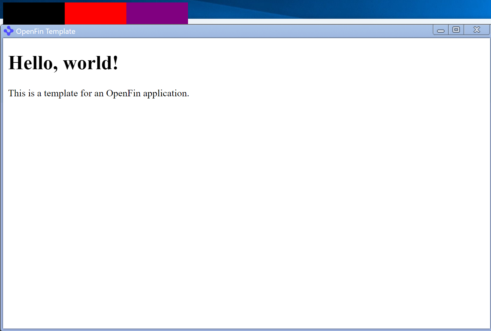
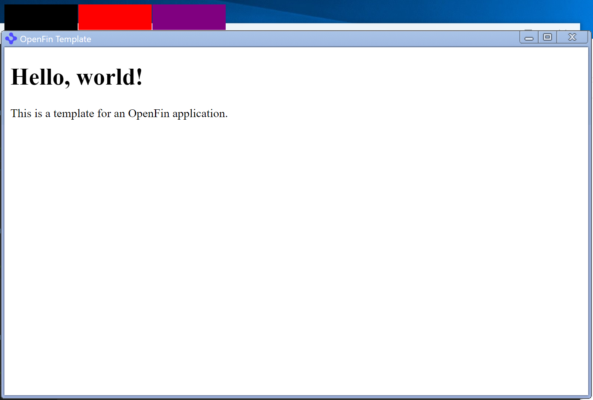

# Small Window Grouping - Moving when Windows sleeps

### How to repro:

* Clone this repository: `git clone https://github.com/luiemilio/small-window-grouping`
* Install the dependencies: `cd small-window-grouping` & `npm install`
* Start the application: `npm start`
* After application starts, you should see 3 small windows on top of the main window like so:

* Put the Windows machine to sleep. Leave it for a while (10 to 15 minutes)
* Bring it back from sleep, the small windows should have moved a bit like so:
